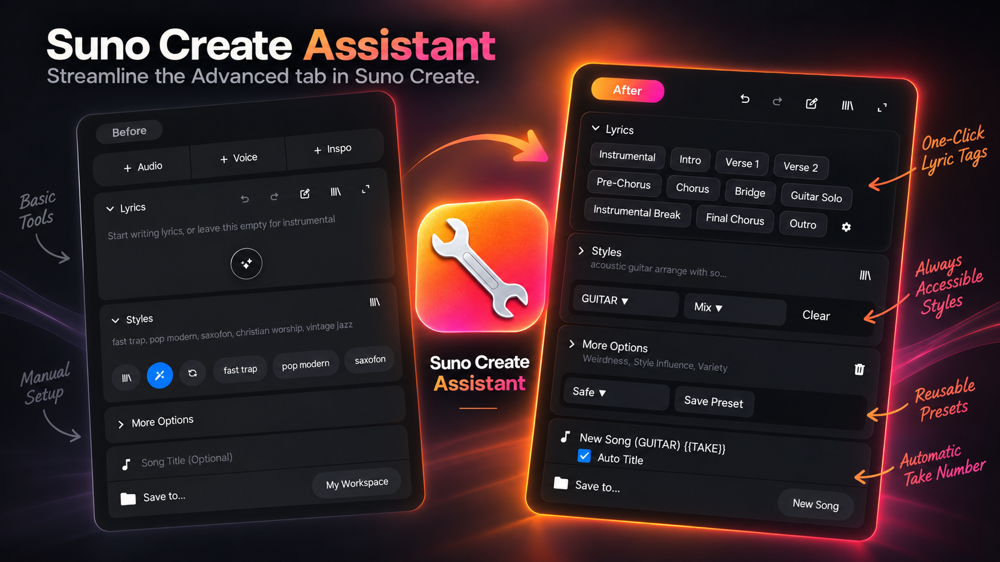
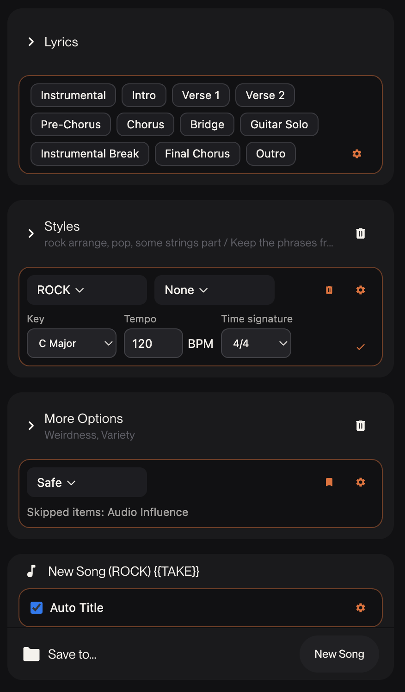
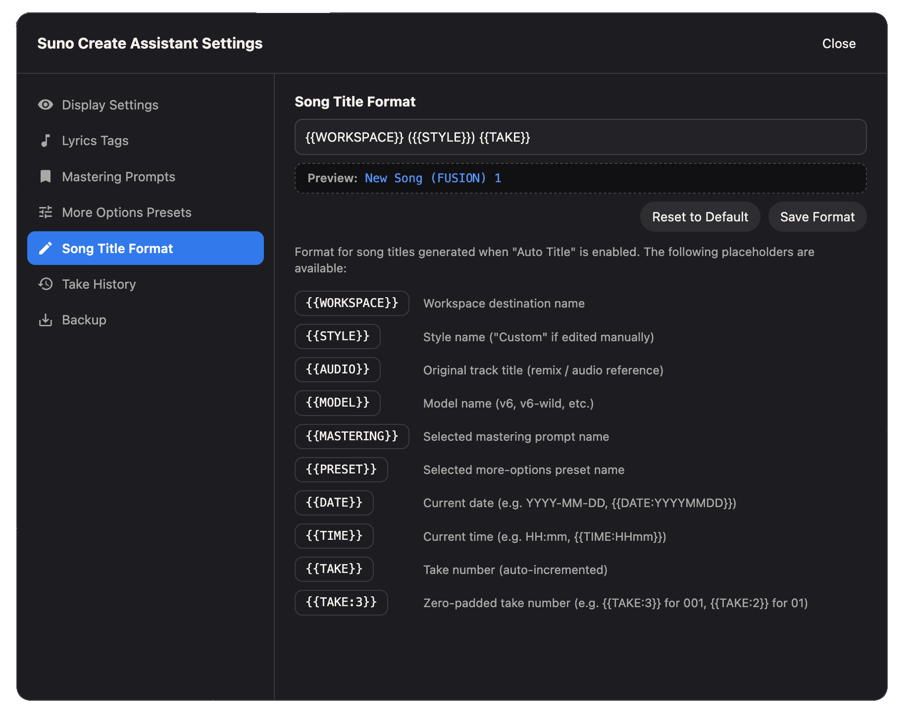

# Suno Create Assistant

[Suno Create](https://suno.com/create) のアドバンストタブ向けローカルChrome拡張です。保存済みスタイルへの素早いアクセス、独自マスタリングプロンプト、再利用可能な詳細オプションプリセット、曲名の自動設定を追加します。日本語・英語どちらのSuno画面でも、言語を自動検知して動作します。



## インストール手順

本リポジトリにはビルド済みの拡張機能（`install/chrome-mv3`）が含まれているため、Node.js やビルドツールの環境構築なしですぐに利用できます。

1. 本リポジトリのコードをダウンロード（**Code** → **Download ZIP**）して解凍、または `git clone https://github.com/Nihondo/suno_create_assistant.git` します。
2. Google Chrome で `chrome://extensions` を開き、右上の **デベロッパーモード** を有効にします。
3. **パッケージ化されていない拡張機能を読み込む** をクリックし、リポジトリ内の `install/chrome-mv3` フォルダを選択します。
4. [Suno Create](https://suno.com/create) を開き、**アドバンスト** タブを選択すると機能が有効になります。

## 機能



### 歌詞タグパレット

**Lyrics**（歌詞）の見出し直下に、楽曲構成タグ（`Instrumental`, `Intro`, `Verse 1`, `Chorus` など）をワンクリックで挿入できるボタン列を表示します。

- タグボタンをクリックすると、角括弧付きのタグ（例: `[Verse 1]`）が独立した行として歌詞欄に挿入されます。歌詞欄が閉じている場合は自動的に展開され、カーソル位置を保ったまま入力を続けられます。
- 設定ダイアログの **Lyrics Tags**（歌詞タグ）から、登録タグを1行1タグ形式で編集・追加・削除・並び替えでき、いつでも初期値に戻せます。

### スタイルとマスタリング

**Style**（スタイル）の見出し直下に、スタイルとマスタリングの2つのプルダウンを表示します。スタイルセクションの開閉状態に関わらず常に見えます。

- 保存済みSunoスタイルと、任意でマスタリングプロンプトを選択すると、両方が別の行としてスタイル欄へ入力されます。
- **Manage…**（管理…）からマスタリングプロンプトの追加・編集・削除ができます。
- Suno側で保存スタイルを追加・改名・削除した場合は、拡張のプルダウンを一度閉じて開き直すと最新の一覧に更新されます。
- スタイルとマスタリングを合わせてSunoの1,000文字制限を超える場合は、何も変更せずエラーを表示します。

### 詳細オプションのプリセット

プリセットプルダウンは、**More Options**（その他のオプション）の見出し直下に表示され、パネルの開閉状態に関わらず常に見えます。スタイル除外、ボーカル性別、長さ、Maxモード、奇抜さ、スタイルの影響、バリエーション、オーディオの影響、パーソナライズのうち、好きな項目を組み合わせて保存できます。

- プルダウン横の **Save Preset**（設定を保存）を押すと、Sunoの現在値を取り込んだ作成ダイアログが開きます。More Optionsが閉じていても取得可能です。保存したい項目を選び、値を編集して保存してください。
- プルダウン内の **Manage presets…**（プリセットを管理…）から既存プリセットの編集・削除ができます。
- 適用時には、そのプリセットに含まれる項目だけが変更され、それ以外はそのままです。

### 曲名の自動設定とテイク番号

曲名セクション内の **Auto title**（自動設定）を有効にすると、テンプレートに従って曲名を自動生成します。初期値は次の形式です。

```text
{{WORKSPACE}} ({{STYLE}}) {{TAKE}}
```

設定ダイアログの **Song Title Format**（曲名フォーマット）から、いつでもテンプレートを変更できます。利用可能なプレースホルダ：

- `{{WORKSPACE}}` — 保存先（ワークスペース名）
- `{{STYLE}}` — スタイル名（手動編集時は `Custom` / `カスタム`）
- `{{AUDIO}}` — 元曲名（リミックス・参照オーディオ設定時）
- `{{TAKE}}` — テイク番号（自動でカウントアップ）

曲名に `{{TAKE}}` が含まれている場合、**作成ボタン**（または下記のショートカット）を使うと、次のテイク番号を入力してから送信し、送信後は曲名欄を `{{TAKE}}` 入りテンプレートへ自動的に戻します。Auto titleを無効にしたまま手動で `{{TAKE}}` を入力しても、同様にテイク番号を管理できます。

### 作成ショートカット

Suno作成画面のどこにいても、`Cmd + Enter`（macOS） / `Ctrl + Enter`（Windows/Linux）を押すだけで「作成」ボタンを実行できます。設定は不要です。



### 拡張設定メニュー

サイドバーのナビゲーション（Hooksの下）に、歯車アイコン付きの **Extension Settings**（拡張設定）メニューを追加します。クリックすると設定ダイアログが開き、曲名フォーマット、表示設定、マスタリングプロンプト、プリセットを一括管理できます。

### セクションの初期折りたたみ

アドバンスドタブを開いた際、「歌詞」「スタイル」「その他のオプション」の各セクションは初期状態で閉じています。拡張機能のプルダウン（スタイル・マスタリング・プリセット）は見出し行に常に表示されているため、開かなくても操作できます。この自動折りたたみは、設定ダイアログの **表示設定** にある「アドバンスドタブを開いた時に歌詞、スタイル、その他のオプションを閉じる」チェックボックスでオフにできます。手動で開いたセクションは、編集中に勝手に閉じられることはありません。

### テイク履歴とパラメータの再利用

**作成ボタン** を押すたびに、その時点のスタイル・マスタリング・プリセット・その他のオプションの設定を自動的に記録します。Sunoの曲一覧で紐付く曲が見つかると、その行のアクション（いいね・シェアなどと並ぶ位置）に小さな **パラメータを再利用** ボタンが表示され、クリックするとその生成時のその他のオプション設定を再適用できます。

- 設定ダイアログの **テイク履歴** から、過去の記録の閲覧・復元・削除ができます。
- **プリセットとして保存** で、過去の記録の設定をそのまま再利用可能なプリセットにできます。
- 再適用されるのはその他のオプションのみです。スタイル欄は書き換えません。スタイル本文の再利用はSuno自身の「プロンプトを再利用」機能が担うためです。
- この機能を使い始める前に生成した曲や、生成完了前にページを離れた曲には、再利用ボタンが表示されない場合があります。

### バックアップ（エクスポート・インポート）

設定ダイアログの **バックアップ** から、マスタリングプロンプト・プリセット・歌詞タグ・曲名フォーマット・（任意で）テイク履歴を含むすべての設定をJSONファイルとして書き出したり、以前書き出したファイルを読み込んだりできます。読み込みは現在の設定をすべて置き換えます。別のパソコンへの移行、Chromeプロファイルの復旧、バージョン管理での保管などにご利用ください。外部への送信は一切なく、ファイルの書き出し・読み込みはすべてお使いの端末内で完結します。

## プライバシー

マスタリングプロンプト、プリセット、テイク履歴、自動設定、曲名フォーマット、テイク番号などの設定はすべてお使いのブラウザ内にのみ保存され、外部へ送信されることはありません。Sunoの非公開APIを呼び出すこともなく、Suno保存スタイルのプロンプト本文を読み取っても、それを恒久的に保存することはありません。設定のエクスポートはお使いの端末上にファイルを保存するだけで、どこにもアップロードされません。

## 免責事項

本拡張機能は個人開発による非公式ツールであり、Suno, Inc. との提携、承認、スポンサーシップ等はありません。「Suno」は Suno, Inc. の登録商標です。

本拡張機能は Suno のWebインターフェース（DOM構造やUIコンポーネント）と直接連携して動作しているため、今後のSuno側の仕様変更やアップデート、UIデザイン変更等によって機能の一部またはすべてが動作しなくなる可能性があります。あらかじめご了承ください。

## ライセンス

[MIT](LICENSE)
